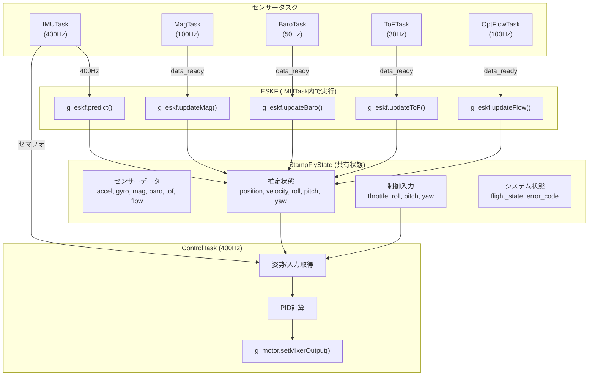
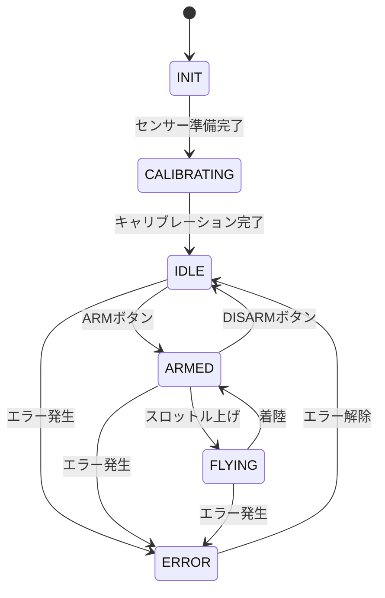

# StampFly 開発者ガイド

このドキュメントは、StampFly RTOSスケルトンに機能を追加する開発者向けのガイドです。

## 目次

1. [main.cppの構造](#maincppの構造)
2. [タスク構成とタイミング](#タスク構成とタイミング)
3. [データフロー](#データフロー)
4. [飛行制御コードの追加方法](#飛行制御コードの追加方法)
5. [新しいセンサーの追加](#新しいセンサーの追加)
6. [CLIコマンドの追加](#cliコマンドの追加)
7. [状態管理](#状態管理)
8. [デバッグ方法](#デバッグ方法)

---

## main.cppの構造

`main/main.cpp`は以下のセクションで構成されています：

```
┌─────────────────────────────────────────────────────────────┐
│ 1. インクルードと定数定義 (1-110行目)                       │
│    - GPIO定義、タスク優先度、スタックサイズ                 │
├─────────────────────────────────────────────────────────────┤
│ 2. グローバルインスタンス (112-202行目)                     │
│    - センサードライバ (g_imu, g_mag, g_baro, etc.)          │
│    - アクチュエータ、推定器、通信、タスクハンドル           │
├─────────────────────────────────────────────────────────────┤
│ 3. ヘルパー関数 (204-256行目)                               │
│    - setMagReferenceFromBuffer(), onBinlogStart()           │
├─────────────────────────────────────────────────────────────┤
│ 4. タイマーコールバック (258-273行目)                       │
│    - imu_timer_callback() - 400Hz精密タイミング             │
├─────────────────────────────────────────────────────────────┤
│ 5. タスク関数 (275-1140行目) ★重要                         │
│    - IMUTask (400Hz) - ESKF更新                             │
│    - ControlTask (400Hz) - 飛行制御 ★スタブ                │
│    - OptFlow/Mag/Baro/ToF/Power/LED/Button/Comm/CLI         │
├─────────────────────────────────────────────────────────────┤
│ 6. イベントハンドラ (1039-1129行目)                         │
│    - onButtonEvent(), onControlPacket()                     │
├─────────────────────────────────────────────────────────────┤
│ 7. 初期化関数 (1131-1627行目)                               │
│    - initI2C/Sensors/Actuators/Estimators/Communication/CLI │
├─────────────────────────────────────────────────────────────┤
│ 8. エントリポイント (1629-1747行目)                         │
│    - app_main() - 初期化シーケンス                          │
└─────────────────────────────────────────────────────────────┘
```

---

## タスク構成とタイミング

### CPUコア割り当て

| Core | タスク | 理由 |
|------|--------|------|
| Core 1 | IMUTask (400Hz) | 高頻度処理、Core 0と分離 |
| Core 1 | ControlTask (400Hz) | IMUと同期、リアルタイム制御 |
| Core 1 | OptFlowTask (100Hz) | SPI通信、IMUと同じCore |
| Core 0 | MagTask, BaroTask, ToFTask | I2Cセンサー群 |
| Core 0 | その他すべて | 低優先度タスク |

### タスク優先度 (高い順)

| 優先度 | タスク | 周波数 | 役割 |
|--------|--------|--------|------|
| 24 | IMUTask | 400Hz | センサー読み取り + ESKF |
| 23 | **ControlTask** | 400Hz | **飛行制御 (スタブ)** |
| 20 | OptFlowTask | 100Hz | オプティカルフロー |
| 18 | MagTask | 100Hz | 地磁気 |
| 16 | BaroTask | 50Hz | 気圧 |
| 15 | CommTask | 50Hz | ESP-NOW通信 |
| 14 | ToFTask | 30Hz | ToFセンサー |
| 12 | PowerTask | 10Hz | 電源監視 |
| 10 | ButtonTask | 100Hz | ボタン入力 |
| 8 | LEDTask | 30Hz | LED制御 |
| 5 | CLITask | - | USBシリアル |

---

## データフロー



**StampFlyState の内容:**

| カテゴリ | データ |
|---------|--------|
| センサーデータ | accel_, gyro_, mag_, baro_, tof_, flow_ |
| 推定状態 | position_, velocity_, roll_, pitch_, yaw_ |
| 制御入力 | ctrl_throttle_, ctrl_roll_, ctrl_pitch_, ctrl_yaw_ |
| システム状態 | flight_state_, error_code_, pairing_state_ |

---

## 飛行制御コードの追加方法

### ControlTaskについて

**ControlTask**は`main.cpp`の569行目付近に実装されています。
このタスクは400HzでIMUTaskと同期して実行されます。

現在のスタブ実装では、スロットル入力をそのまま全モーターに送っているだけです：

```cpp
// Simple throttle control: all motors receive same throttle value
g_motor.setMotor(stampfly::MotorDriver::MOTOR_FR, throttle);  // M1
g_motor.setMotor(stampfly::MotorDriver::MOTOR_RR, throttle);  // M2
g_motor.setMotor(stampfly::MotorDriver::MOTOR_RL, throttle);  // M3
g_motor.setMotor(stampfly::MotorDriver::MOTOR_FL, throttle);  // M4
```

この状態では姿勢制御が行われないため、**安定した飛行はできません**。
飛行制御を実装するには、以下のステップで角速度制御を追加する必要があります。

### Step 1: 角速度制御（Rate Control）の実装

まず**角速度制御**を実装します。これはジャイロセンサから得られる角速度を目標角速度に追従させる制御です。

```cpp
// 角速度制御ゲイン
constexpr float KP_RATE_ROLL  = 0.5f;
constexpr float KP_RATE_PITCH = 0.5f;
constexpr float KP_RATE_YAW   = 0.3f;

// ジャイロ（角速度）を取得
stampfly::Vec3 accel, gyro;
state.getIMUData(accel, gyro);

// コントローラー入力を取得
// throttle: 0.0 ~ 1.0, roll/pitch/yaw: -1.0 ~ +1.0
float throttle_cmd, roll_cmd, pitch_cmd, yaw_cmd;
state.getControlInput(throttle_cmd, roll_cmd, pitch_cmd, yaw_cmd);

// 目標角速度 [rad/s]
constexpr float MAX_RATE = 3.0f;  // 最大角速度 約170 deg/s
float roll_rate_target  = roll_cmd  * MAX_RATE;
float pitch_rate_target = pitch_cmd * MAX_RATE;
float yaw_rate_target   = yaw_cmd   * MAX_RATE;

// 角速度誤差
float roll_rate_error  = roll_rate_target  - gyro.x;
float pitch_rate_error = pitch_rate_target - gyro.y;
float yaw_rate_error   = yaw_rate_target   - gyro.z;

// P制御（角速度フィードバック）
float roll_out  = KP_RATE_ROLL  * roll_rate_error;
float pitch_out = KP_RATE_PITCH * pitch_rate_error;
float yaw_out   = KP_RATE_YAW   * yaw_rate_error;

// モーターミキシング
g_motor.setMixerOutput(throttle_cmd, roll_out, pitch_out, yaw_out);
```

角速度制御のみでも、スティックを離せば角速度がゼロに収束するため、
ある程度の安定性は得られます（アクロバットモード相当）。

### Step 2: 姿勢制御（Attitude Control）の実装【課題】

**姿勢制御の実装はユーザーへの課題とします。**

姿勢制御を実装する際は、**カスケード制御（2重ループ制御）** を強く推奨します：

```
┌─────────────────────────────────────────────────────────────────┐
│                    カスケード制御構造                            │
├─────────────────────────────────────────────────────────────────┤
│                                                                 │
│  目標姿勢    ┌────────────┐  目標角速度   ┌────────────┐        │
│  ─────────→ │ 角度制御器  │ ──────────→ │ 角速度制御器 │ → モーター │
│             │(アウター)   │              │(インナー)   │        │
│             └────────────┘              └────────────┘        │
│                   ↑                           ↑               │
│                   │                           │               │
│             現在姿勢(ESKF)               現在角速度(ジャイロ)     │
│                                                                 │
└─────────────────────────────────────────────────────────────────┘
```

**なぜカスケード制御か？**

1. **インナーループ（角速度制御）**: 高速応答（400Hz）、外乱抑制
2. **アウターループ（角度制御）**: 目標姿勢への追従

この構造により：
- 角速度制御が高速に動作し、機体の安定性を確保
- 角度制御は角速度制御を「アクチュエータ」として使用
- チューニングが容易（まずインナー、次にアウター）

**実装のヒント：**

```cpp
// アウターループ（角度制御）
float roll_error  = roll_target  - roll_current;
float pitch_error = pitch_target - pitch_current;

// アウターループの出力 = インナーループの目標角速度
float roll_rate_target  = KP_ANGLE_ROLL  * roll_error;
float pitch_rate_target = KP_ANGLE_PITCH * pitch_error;

// インナーループ（角速度制御）
float roll_rate_error  = roll_rate_target  - gyro.x;
float pitch_rate_error = pitch_rate_target - gyro.y;

float roll_out  = KP_RATE_ROLL  * roll_rate_error;
float pitch_out = KP_RATE_PITCH * pitch_rate_error;
```

**チューニング手順：**

1. まずStep 1の角速度制御のみで飛行テスト
2. 角速度制御が安定したら、アウターループ（角度制御）を追加
3. アウターループのゲインは控えめから開始

### モーターミキシングAPI

```cpp
// 推奨: 高レベルAPI（内部でX-quadミキシング）
g_motor.setMixerOutput(thrust, roll, pitch, yaw);

// 低レベル: 個別モーター制御
g_motor.setMotor(stampfly::MotorDriver::MOTOR_FR, value);  // 0.0-1.0
g_motor.setMotor(stampfly::MotorDriver::MOTOR_RR, value);
g_motor.setMotor(stampfly::MotorDriver::MOTOR_RL, value);
g_motor.setMotor(stampfly::MotorDriver::MOTOR_FL, value);
```

### X-Quadモーター配置

```
          前方
           ▲
    FL(M4)     FR(M1)
      CW  ╲ ╱  CCW
           X
     CCW  ╱ ╲  CW
    RL(M3)     RR(M2)
           ▽
          後方
```

| モーター | 位置 | 回転方向 | GPIO |
|---------|------|---------|------|
| M1 (FR) | 前右 | CCW (反時計回り) | 42 |
| M2 (RR) | 後右 | CW (時計回り) | 41 |
| M3 (RL) | 後左 | CCW (反時計回り) | 10 |
| M4 (FL) | 前左 | CW (時計回り) | 5 |

> **Note:** 対角のモーターは同じ回転方向（FL-RR=CW、FR-RL=CCW）

---

## 新しいセンサーの追加

### 1. コンポーネントの作成

```
components/stampfly_newsensor/
├── CMakeLists.txt
├── include/
│   └── newsensor.hpp
└── newsensor.cpp
```

### 2. main.cppへの統合

```cpp
// グローバルインスタンス追加
stampfly::NewSensor g_newsensor;

// initSensors()に初期化コード追加
{
    stampfly::NewSensor::Config cfg;
    cfg.i2c_bus = g_i2c_bus;
    ret = g_newsensor.init(cfg);
    if (ret == ESP_OK) {
        ESP_LOGI(TAG, "NewSensor initialized");
    }
}

// 必要に応じて専用タスクを追加
static void NewSensorTask(void* pvParameters) {
    // ...
}
```

---

## CLIコマンドの追加

### 1. cli.cppにハンドラ追加

```cpp
// Forward declaration
static void cmd_mycommand(int argc, char** argv, void* context);

// registerDefaultCommands()に登録
registerCommand("mycommand", cmd_mycommand, "My new command", this);

// ハンドラ実装
static void cmd_mycommand(int argc, char** argv, void* context)
{
    CLI* cli = static_cast<CLI*>(context);
    cli->print("Hello from mycommand!\r\n");
}
```

### 2. 外部グローバル変数へのアクセス

```cpp
// cli.cpp先頭で宣言
extern stampfly::MyClass* g_myclass_ptr;

// main.cppでポインタ設定
stampfly::MyClass* g_myclass_ptr = nullptr;
// 初期化後に
g_myclass_ptr = &g_myclass;
```

---

## 状態管理

### FlightState（飛行状態）



| 状態 | 説明 | LED |
|------|------|-----|
| INIT | 初期化中 | 青・呼吸 |
| CALIBRATING | キャリブレーション中 | 黄・高速点滅 |
| IDLE | 待機中（ARM可能） | 緑・常灯 |
| ARMED | アーム済み（飛行準備完了） | 緑・低速点滅 |
| FLYING | 飛行中 | 黄・常灯 |
| ERROR | エラー発生 | 赤・高速点滅 |

### StampFlyStateへのアクセス

```cpp
auto& state = stampfly::StampFlyState::getInstance();

// 読み取り
float voltage = state.getVoltage();
stampfly::FlightState fs = state.getFlightState();

// 書き込み
state.updateAttitude(roll, pitch, yaw);
state.setFlightState(stampfly::FlightState::FLYING);
```

---

## デバッグ方法

### 1. CLIコマンド

| コマンド | 説明 |
|----------|------|
| `status` | システム状態表示 |
| `sensor all` | 全センサーデータ表示 |
| `ctrl watch` | コントローラー入力監視 |
| `loglevel info` | ESP_LOGを有効化 |
| `teleplot on` | Teleplot形式出力 |
| `binlog on` | 400Hzバイナリログ開始 |
| `debug on` | エラー無視モード |

### 2. ESP_LOGの使用

```cpp
ESP_LOGI(TAG, "Info message: %d", value);
ESP_LOGW(TAG, "Warning message");
ESP_LOGE(TAG, "Error message");
```

CLIで有効化：`loglevel info` または `loglevel debug`

### 3. バイナリログの解析

```bash
# ログ収集
python tools/scripts/log_capture.py /dev/ttyACM0 output.bin

# 解析（tools/eskf_debugで）
./eskf_replay output.bin
```

---

## ファイル構成

```
stampfly_rtos_skelton/
├── main/
│   └── main.cpp              ← メインエントリポイント
├── components/
│   ├── stampfly_state/       ← 状態管理（シングルトン）
│   ├── stampfly_imu/         ← BMI270ドライバ
│   ├── stampfly_mag/         ← BMM150ドライバ
│   ├── stampfly_baro/        ← BMP280ドライバ
│   ├── stampfly_tof/         ← VL53L3CXドライバ
│   ├── stampfly_opticalflow/ ← PMW3901ドライバ
│   ├── stampfly_power/       ← INA3221ドライバ
│   ├── stampfly_motor/       ← モータードライバ
│   ├── stampfly_led/         ← WS2812 LEDドライバ
│   ├── stampfly_buzzer/      ← ブザードライバ
│   ├── stampfly_button/      ← ボタンドライバ
│   ├── stampfly_eskf/        ← ESKFフィルター
│   ├── stampfly_filter/      ← LPF/推定器
│   ├── stampfly_comm/        ← ESP-NOW通信
│   ├── stampfly_cli/         ← USBシリアルCLI
│   ├── stampfly_logger/      ← バイナリログ
│   └── stampfly_math/        ← 数学ライブラリ
├── docs/                     ← ドキュメント
└── tools/                    ← 開発ツール
```

---

## 注意事項

1. **スレッドセーフティ**: `StampFlyState`はmutexで保護されています。直接メンバーにアクセスせず、getter/setterを使用してください。

2. **タイミング**: IMUTaskは400Hzの精密タイミングが必要です。同じCore 1で重い処理を追加しないでください。

3. **I2Cバス**: 複数のI2Cセンサーが同じバスを共有しています。各タスクはCore 0で実行され、I2Cドライバ内部でスレッドセーフに処理されます。

4. **ESKF更新**: すべてのESKF更新はIMUTask内で行われます。他のセンサータスクはデータをキャッシュしてフラグを立てるだけです（レースコンディション防止）。

5. **モーター安全**: `g_motor.setThrottle()`を呼ぶ前に、必ずフライト状態をチェックしてください。


